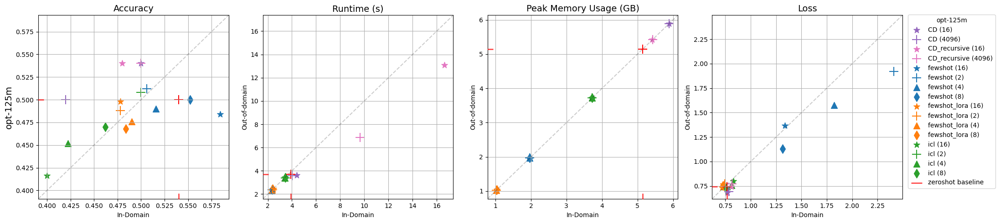
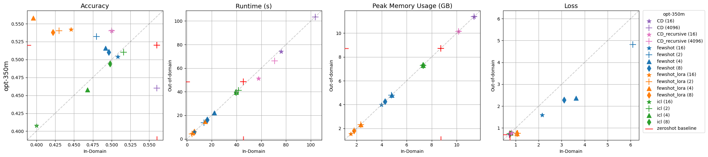
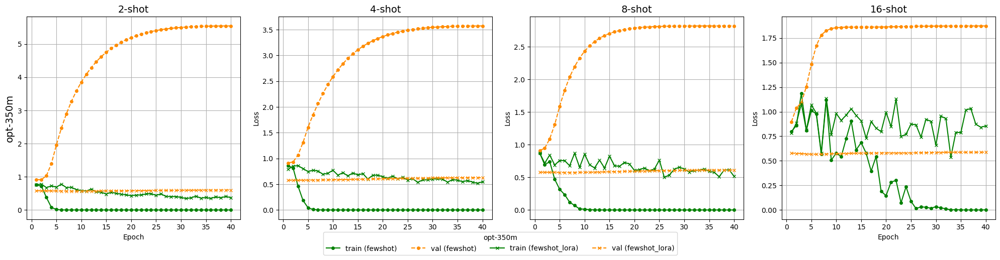

# llm-finetuning

## Authors
[Harrison Floam](https://github.com/harrisonfloam), [Ethan Lumbantobing](https://github.com/eTobing), and [Joel McCarty](https://github.com/jmcc5).

## Outline

- `data`: saved datasets from huggingface
- [`experiments`](https://github.com/jmcc5/llm-finetuning/tree/main/experiments): experiment notebooks
- [`logs`](https://github.com/jmcc5/llm-finetuning/tree/main/logs): csv output from task adaptation evaluation
- `models`: saved pre-trained and fine-tuned models and tokenizers
- [`src/`](https://github.com/jmcc5/llm-finetuning/tree/main/src): main project directory
  - [`data`](https://github.com/jmcc5/llm-finetuning/tree/main/src/data): functions for fetching and loading datasets
  - [`finetuners`](https://github.com/jmcc5/llm-finetuning/tree/main/src/finetuners): task adaptation methods
  - [`model`](https://github.com/jmcc5/llm-finetuning/tree/main/src/model): functions for fetching and loading models
  - [`visualization`](https://github.com/jmcc5/llm-finetuning/tree/main/src/visualization): functions for graphing fine-tuning output

## Summary
This Python project aims to explore LLM task adaptation methods in an accessible format. We build on work in [uds-lsv/llmft](https://github.com/uds-lsv/llmft) to implement few-shot fine-tuning and in-context learning (ICL) and create our own novel version of context distillation fine-tuning, originally proposed by [Anthropic](https://arxiv.org/abs/2112.00861) in 2021.

We rely heavily on huggingface's [transformers](https://github.com/huggingface/transformers). For ease of compute and iteration, we experiment with smaller models: [OPT-125m](https://huggingface.co/facebook/opt-125m) and [OPT-350m](https://huggingface.co/facebook/opt-350m). We use the MNLI dataset from [GLUE](https://huggingface.co/datasets/glue) as in-domain and [HANS](https://huggingface.co/datasets/hans) as out-of-domain. We also experiment with [Low Rank Adaptation (LoRA)](https://arxiv.org/abs/2106.09685) for [Parameter-efficient Finetuning](https://huggingface.co/docs/peft/index).

## Results
Our experiment [notebook](https://nbviewer.org/github/jmcc5/llm-finetuning/blob/main/experiments/final_experiments.ipynb) contains results for few-shot fine-tuning (with and without LoRA), ICL, and two implementations of context distillation. Few-shot and ICL experiments are repeated 10 times for each sample size with randomly selected training data. Context distillation experiments are repeated only once due to time constraints.




The two figures above present accuracy, runtime, GPU memory usage, and loss for each fine-tuning method, sample size, and model. CONCLUSIONS.




The figures above present training performance for our few-shot experiments, with and without LoRA, in the form of learning curves (loss over training epochs). CONCLUSIONS.

## Setup
Clone the repository.
```
git clone https://github.com/jmcc5/llm-finetuning.git
```
Create a conda environment from the .yml file.
```
conda env create -f environment.yml
conda activate fine-tuning
```
Update it if any packages are added.
```
conda env export --no-builds > environment.yml
```
To enable module importing, run:
```
pip install -e .
```
If you run into issues related to your torch-cuda version, please reinstall the recommended version for your system from https://pytorch.org/get-started/locally/.
